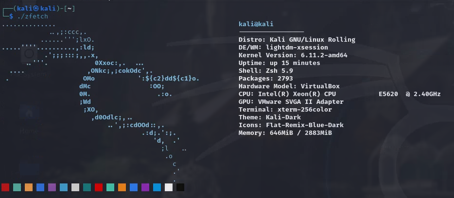

 

# Zfetch
A small neofetch clone in zig 0.13

## Background
Zfetch is a blazingly fast system information fetching tool written in zig.

## How it looks
Behold

## Installation
This is not in any repo, so to install

- Git clone the repo
- cd into the repo
- run `zig build`

You can also download pre-built binaries from the releases page

## Tested on
- [x] Parrot os 
- [x] Kali linux 
- [x] Arch 
- [x] Ubuntu (remnux)
- [x] Fedora 41

Kali

Arch

Ubuntu

Fedora

> This is still in beta, alot to still do, so feel free to contribute to it by checking out the [contribution guide](https://github.com/pop-ecx/zfetch/blob/master/contributing.md)

> The builds are done in debug mode as the project hasn't reached v1.0.0 yet.
